<p align="center">
  
</p>

<p align="center">
  <strong>The pages we lost. The internet we grew up on. Rebuilt from memory.</strong>
</p>

<p align="center">
  <a href="#the-story">The Story</a> · <a href="#the-eras">The Eras</a> · <a href="#clayderman-discography">Clayderman Discography</a> · <a href="#tech-stack">Stack</a> · <a href="#getting-started">Run It</a> · <a href="#contributing">Contribute</a>
</p>

---

<br/>

## The Story

> *"You have 1 new message."*
> 
> Remember that? The Yahoo Messenger ping at 10pm. The 56k modem screaming as it connected. Your first Yahoo 360 blog post — a dramatic status line, a glitter cursor, a song title in the sidebar. The FIFA Online 3 lobby music that still lives rent-free in your head. The day your friend showed you Facebook and you thought: "this is just a blue Yahoo 360."
>
> Those pages are gone now. The servers are off. The URLs return 404.
>
> **But we remember.**

**404 Memories** is not a screenshot gallery. It's a time machine. A single interactive web page where each section *becomes* the platform it represents — the layout shifts, the fonts change, the cursor transforms, the sounds come back. You don't look at the past. You step into it.

Built for the 8x/9x generation of Vietnam. Built from the things we can't Google anymore.

<br/>

## The Eras

```
╔═════════════════════════════════════════════════════════════════╗
║  YEAR       PLATFORM               MEMORY                       ║
╠═════════════════════════════════════════════════════════════════╣
║  1997-2002  Dial-up & Early Web    VnExpress classic, mIRC,     ║
║                                    geocities pages, 56k modem   ║
╠─────────────────────────────────────────────────────────────────╣
║  2003-2005  Yahoo 360°             Blog layouts, sparkly        ║
║                                    cursors, midi autoplay,      ║
║                                    "tâm trạng: buồn"            ║
╠─────────────────────────────────────────────────────────────────╣
║  2005-2007  Zing Me & Avatar       Tea Mobi login screen,       ║
║                                    virtual pets, dress-up,      ║
║                                    Zing MP3 player              ║
╠─────────────────────────────────────────────────────────────────╣
║  2007-2008  Facebook Gen 1         The blue bar, poke wars,     ║
║                                    FarmVille at 2am,            ║
║                                    poke notifications           ║
╠─────────────────────────────────────────────────────────────────╣
║  2008-2009  FIFA Online 3          Lobby music, +8 cards,       ║
║                                    rank grinding til sunrise,   ║
║                                    "disconnect = thua"          ║
╠─────────────────────────────────────────────────────────────────╣
║  2009-2010  iPad & Mobile Dawn     Skeuomorphic everything,     ║
║                                    "the future is touch",       ║
║                                    the end of an era            ║
╚═════════════════════════════════════════════════════════════════╝
```

Each era is a fully styled, interactive section. When you scroll into Yahoo 360, the page *becomes* Yahoo 360. Purple gradients, sparkle cursors, auto-playing midi. When you hit FIFA Online 3, the lobby loads. This is cosplay for websites.

<br/>

## Clayderman Discography

Richard Clayderman's piano recordings are part of the ambient soundtrack of 90s-2000s Vietnam: cafes, wedding videos, CD shops, TV backgrounds, and family slideshows.

A full CSV reference lives in [`clayderman.csv`](clayderman.csv). It includes 4,702 track rows from 250 official MusicBrainz releases, with release type, album dates, country, disc/track numbers, artist credits, and release IDs so the data can be audited and expanded.

<br/>

## Tech Stack

```
Astro           →  static site gen, zero JS by default
Tailwind CSS    →  base layer styling
Raw CSS         →  era-accurate recreations (you can't Yahoo with utility classes)
GSAP            →  scroll-triggered era transitions
Howler.js       →  dial-up tones, messenger pings, lobby music
```

<br/>

## Project Structure

```
404-memories/
├── src/
│   ├── layouts/
│   │   └── TimelineLayout.astro
│   ├── sections/
│   │   ├── 01-dialup/          # modem sounds, green-on-black terminal
│   │   ├── 02-yahoo360/        # purple everything, sparkle cursor
│   │   ├── 03-zingme-avatar/   # tea mobi login, zing mp3 player
│   │   ├── 04-facebook/        # the blue bar, poke button
│   │   ├── 05-fifaonline/      # lobby screen, card pack opening
│   │   └── 06-ipad/            # skeuomorphic, glass shelf UI
│   ├── components/
│   │   ├── TimelineNav.astro   # year slider / channel dial
│   │   ├── AudioPlayer.astro   # ambient era sounds
│   │   └── CRTOverlay.astro    # old monitor scan lines
│   ├── styles/
│   │   └── eras/               # one CSS file per era
│   └── assets/
│       ├── fonts/              # pixel fonts, yahoo fonts
│       ├── cursors/            # sparkle, hand, crosshair
│       └── sounds/             # dial-up, ym ping, fifa lobby
├── public/
│   └── og-image.png
├── assets/
│   └── banner.svg
└── astro.config.mjs
```

<br/>

## Getting Started

```bash
git clone https://github.com/your-username/404-memories.git
cd 404-memories
npm install
npm run dev
```

Open `localhost:4321`. Turn your speakers on.

<br/>

## Contributing

This is a community memory project. If you remember something we forgot — a platform, a sound, a UI detail — open an issue or PR.

**What we need:**

- Public, recreated, or properly licensed visual references
- Sanitized screenshots with names, handles, emails, phone numbers, locations, and private messages removed
- Self-recorded or recreated sounds inspired by the era
- Cultural context without exposing private conversations or personal details
- New era sections or platform recreations
- Vietnamese translations for descriptions

Please do not submit private chats, personal accounts, unblurred screenshots, leaked data, proprietary source files, or copyrighted media you do not have permission to share.

---

<p align="center">
  <sub><i>"Bạn có 1 tin nhắn mới"</i></sub><br/><br/>
  
  
  
</p>
